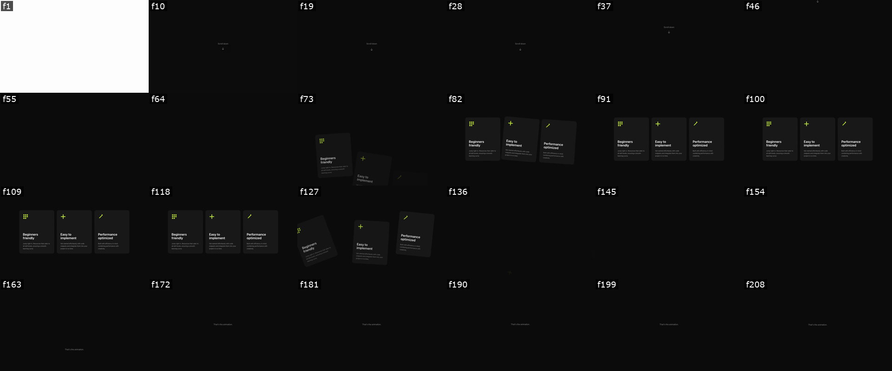

# web-motion

**Close the agentic coding loop for web animation.** Give your coding agent the ability to scroll your page while recording, analyze the result frame-by-frame, and optimize animations through natural language alone — no more screen recordings or trying to describe what *"feels off"*.

---

## TL;DR

Ask Claude:
> *"/web-motion this entrance animation feels robotic, fix it"*
> *"/web-motion there's a flicker on page transitions, find it"*
> *"/web-motion recreate this GSAP scroll-into-view animation"*

That's it. Claude records your page, inspects it frame-by-frame, and ships the fix.

---

## Setup

**1. Clone the skill into Claude Code's skills directory**
```bash
git clone https://github.com/Schmandarine/web-motion-skill ~/.claude/skills/web-motion
```
This makes the skill available globally in Claude Code — no project-level config needed.

**2. Install dependencies**
```bash
bash ~/.claude/skills/web-motion/scripts/setup.sh
```
Installs three things (asks consent before each):
- **ffmpeg** (~80MB) — converts recorded video to frames
- **Playwright** — installed locally inside the skill dir, no project pollution
- **Chromium** (~300MB) — the headless browser that records your page

**3. Reload Claude Code** — the skill auto-triggers on animation tasks, or invoke it explicitly with `/web-motion`.

Within about 15 seconds Claude has a 24-tile labelled contact sheet of your animation, reads it as a single image, identifies where the animation breaks, and writes the fix.

---

## What Claude actually sees

After running `analyze.sh` + `contact-sheet.sh`, Claude reads one image like this:



Each tile is a frame from the recording, labelled with its real source frame number. From this single image Claude can answer:

- **When does the entrance start?** — around f64, cards begin rising from below
- **How long is the dwell?** — f82 → f118, ~1.4s of cards held in place
- **When does the exit begin?** — f127, the scatter throw starts
- **Is the stagger direction correct?** — left card leads (matches reading order ✓)
- **Are any frames jumping or clipping?**

Then Claude drills into the interesting window — reads `f64` through `f80` individually to confirm the entrance timing, or `f127` through `f140` to confirm the exit. The same workflow a motion designer uses reviewing a take in After Effects.

---

## Why this exists

Until now, the loop for fixing a web animation with a coding agent has been open:

1. You watch the animation.
2. You try to articulate what feels wrong (*"too fast"*, *"feels robotic"*, *"the exit is jarring"*).
3. The agent guesses what you mean and edits code.
4. You watch again — still wrong.
5. Repeat.

The agent can write animation code but never actually sees it run. You're the only one in the loop with vision. This skill closes the loop by giving Claude two things:

**1. Vision** — bundled scripts record the page with headless Chromium, extract frames at 25fps, and build a labelled contact sheet. The agent reads images directly and reasons about timing, easing, and trajectory.

**2. Judgment** — Disney's 12 Principles of Animation, adapted for web, GSAP, CSS, and scroll input. Once the agent can see what's broken, the principles tell it how to fix it.

With both, you can describe a problem in natural language — or just say *"the exit feels off"* — and the agent records, watches, diagnoses, and fixes on its own. No more sending screen recordings back and forth.

---

## The 12 Principles, Web-Adapted

Disney's 12 Principles of Animation — adapted for GSAP, CSS, and scroll-scrubbed animation. These are baked into the skill so the agent can name what's wrong, not just see it.

### 1. Slow In / Slow Out
Real objects have mass — they accelerate from rest and decelerate back to rest.
**Web:** Use `power2.inOut` or `cubic-bezier(0.4, 0, 0.2, 1)` for most movements. For scroll-scrubbed animations this is the transfer function that makes linear scroll feel physical.

### 2. Anticipation
A small preparatory motion in the opposite direction before the main action adds energy and signals intent.
**Web:** Button scales down slightly before triggering. A card tilts before flying off. Keep it subtle (0.05–0.1 scale, 3–8deg) — it should register subconsciously.

### 3. Follow Through & Overlapping Action
Parts of a system continue moving after the main body stops. A group of elements starts and ends at slightly different times.
**Web:** Stagger. Offset start times (`stagger: 0.08` in GSAP). A reversed stagger (`stagger: -0.12`) makes the last element lead, which often looks more natural for elements entering from below.

### 4. Squash & Stretch
Objects deform to show mass and flexibility.
**Web:** `scale(0.95)` on button press. Spring eases that overshoot and bounce back. Avoid for UI that must feel rigid — use for playful, expressive moments.

### 5. Staging
Composition and timing direct the user's eye to what matters.
**Web:** Animate headline first, body text second, CTA last. Don't animate 6 things at once — stage them so attention lands where you want it.

### 6. Secondary Action
Additional actions that support the main action without competing with it.
**Web:** Icon rotates while its parent card slides in. A checkmark draws itself after a form submits. If it draws attention away from the main event, it's too prominent.

### 7. Timing
Duration determines perceived weight, speed, and mood.

| Duration | Use |
|---|---|
| `100–150ms` | Immediate feedback (button press, hover state) |
| `200–300ms` | UI transitions (dropdown, tooltip, tab switch) |
| `400–600ms` | Meaningful transitions (modal enter, section change) |
| `600ms+` | Emphasis or storytelling (hero entrance, scroll reveals) |

### 8. Exaggeration
Push the action beyond realism to clarify intent and add personality.
**Web:** Spring eases that overshoot 10–15%. Rotation on a scatter effect at ±60–70deg instead of ±20deg. Scale on hover at 1.08 instead of 1.02. Calibrate to the product's personality.

### 9. Arc
Natural movements follow curved paths — straight-line motion feels mechanical.
**Web:** Animate `x` and `y` with slightly different eases so diagonal paths curve. Cards thrown off-screen should arc, not travel in straight vectors.

### 10. Depth
Objects exist in 3D space. In flat UI, depth is simulated.
**Web:** Parallax (foreground moves faster than background). `perspective` + `rotateX/Y` for card tilt on hover. Shadows that shift as elements lift. z-index layering reinforced by scale.

### 11. Pose to Pose vs. Straight Ahead
Define key states and interpolate (pose to pose), or simulate physics frame by frame (straight ahead).
**Web:** CSS transitions and GSAP tweens are pose to pose. Use physics engines only when motion is too complex to keyframe — falling debris, cloth, fluid.

### 12. Appeal — Motion Language Consistency
The overall animation system should feel coherent. Every motion choice communicates something about the product.
**Web:** Pick an easing vocabulary and stick to it. If entrance animations use `power2.inOut`, exits should too — same object, same physics. Fast and snappy = confident and modern. Slow and heavy = thoughtful and premium. Be intentional, be consistent.

---

## Prerequisites

- **Node.js** (≥18 recommended) — the only hard prerequisite. `setup.sh` installs the rest.
- **macOS or Linux** — Windows untested.
- **A running dev server** — `analyze.sh` opens a real browser at the URL you give it, so the page has to be reachable. Start your dev server in a separate terminal *before* running the analyze command.
- **~400MB free disk space** for the Chromium browser and Playwright cache.

---

## Install

```bash
git clone https://github.com/Schmandarine/web-motion-skill ~/.claude/skills/web-motion
bash ~/.claude/skills/web-motion/scripts/setup.sh
```

`setup.sh` is platform-aware and asks consent before each install:

- **ffmpeg** (~80MB) — via Homebrew on macOS, apt on Linux
- **playwright** npm package — installed locally inside the skill directory, so it doesn't pollute any project
- **Chromium browser** (~300MB) — downloaded via `npx playwright install chromium`

A `.installed` marker is written on success. Subsequent runs skip the check.

Firefox and WebKit are **not installed** and are not part of the normal loop. They are only
needed if you explicitly want to compare an animation across browser engines:

```bash
bash ~/.claude/skills/web-motion/scripts/setup.sh --engines   # ~600MB, prompts first
```

Reload Claude Code. The skill auto-triggers on animation tasks, or you can invoke it explicitly via `/web-motion`.

---

## Usage

### A full debugging session

**1. Start your dev server.** `analyze.sh` records a real browser session — the page needs to be reachable.

```bash
cd ~/your-project
npm run dev          # or any other dev server
# → http://localhost:5173
```

**2. Ask Claude to debug the animation.** Anything that involves motion auto-triggers the skill:

> the card entrance animation feels off, can you check it?

**3. Claude asks before recording**, then runs:

```bash
bash ~/.claude/skills/web-motion/scripts/analyze.sh http://localhost:5173/your-page.html
```

Under the hood this launches headless Chromium, scrolls through the page over ~9 seconds, records video to `/tmp/web-motion-<timestamp>/`, converts the webm to mp4, and extracts ~220 frames at 25fps into `/tmp/web-motion-<timestamp>/frames/`.

**4. Claude builds the contact sheet:**

```bash
bash ~/.claude/skills/web-motion/scripts/contact-sheet.sh /tmp/web-motion-*/frames
```

24 frames are sampled evenly, each labelled with its real source frame number, and tiled into a single PNG.

**5. Claude reads the contact sheet and writes the fix.** From the one image it identifies entrance / dwell / exit windows, drills into specific frame numbers to confirm timing issues (`Read /tmp/.../frame_0064.png` etc.), edits your animation code, and re-runs `analyze.sh` to verify the fix worked.

### Auto-trigger phrases

The skill loads automatically when Claude detects motion-related work. Phrases that trigger it:

> *"make these cards animate in from below with a natural feel"*
> *"this exit animation feels abrupt — the cards just disappear"*
> *"what ease should I use for a button press?"*
> *"the entrance feels robotic — how can I make it feel physical?"*

You can also invoke it explicitly with `/web-motion`.

---

## Scripts

| Script | Purpose |
|---|---|
| `doctor.sh` | Check whether all dependencies are installed |
| `setup.sh` | Install missing dependencies (consent-based, platform-aware) |
| `analyze.sh` | One-shot: record scroll animation + extract frames |
| `contact-sheet.sh` | Build a labelled grid of evenly-sampled frames |
| `record-playwright.mjs` | Playwright auto-scroll recording (called by `analyze.sh`) |
| `record-ffmpeg-macos.sh` | Manual screen recording on macOS (for hover/click flows) |
| `record-ffmpeg-linux.sh` | Manual screen recording on Linux |
| `extract-frames.sh` | Extract frames from a video — auto-converts webm → mp4 |

Opt-in, cross-engine only — requires `setup.sh --engines`:

| Script | Purpose |
|---|---|
| `shoot-engines.mjs` | Timed screenshots of the same animation in Chromium/Firefox/WebKit |
| `record-engines.mjs` | Video of the same page per engine (see caveats in SKILL.md) |
| `compare-sheet.sh` | One sheet, one row per engine, one column per moment |

Use screenshots rather than video for cross-engine work: Firefox ignores the requested video
size and WebKit pads the head of the file with blank frames, so videos are not comparable
between engines. Video remains the default for ordinary single-engine analysis.

---

## Works with the Official GSAP Skills

web-motion is one half of the agentic animation loop. The [official GSAP skills](https://github.com/greensock/gsap-skills) are the other half.

| | What it does |
|---|---|
| **GSAP skills** | Teach the agent to *write* correct GSAP code — API, timelines, ScrollTrigger, plugins, React, performance |
| **web-motion** | Teaches the agent to *see* what the code produces — record, extract frames, diagnose, verify |

Running them together, the full loop looks like this:

1. Agent writes animation code → guided by the GSAP skills
2. Agent records the page and extracts frames → web-motion `analyze.sh`
3. Agent reads the contact sheet, names what's wrong (wrong ease, missing dwell, bad stagger direction…)
4. Agent fixes the code → back to the GSAP skills
5. Agent re-records to confirm the fix

**Install the GSAP skills alongside this one:**

```bash
npx skills add https://github.com/greensock/gsap-skills
```

Or in Claude Code: `/plugin marketplace add greensock/gsap-skills`

---

## Background

The core insight behind this skill: a `power2.inOut` ease curve is a mathematical approximation of how real objects with mass behave — accelerating from rest, decelerating back to rest. On a scroll-scrubbed animation, that curve acts as a *transfer function* that converts the mechanical linearity of scroll input into something the eye reads as physical.

This is why two animations that move the same element between the same positions can feel completely different — one natural, one robotic — based purely on the ease curve.

---

## Requirements

- [Claude Code](https://claude.ai/code) installed and authenticated
- Node.js (≥18 recommended)
- macOS or Linux
- ~400MB free disk space

## License

MIT
